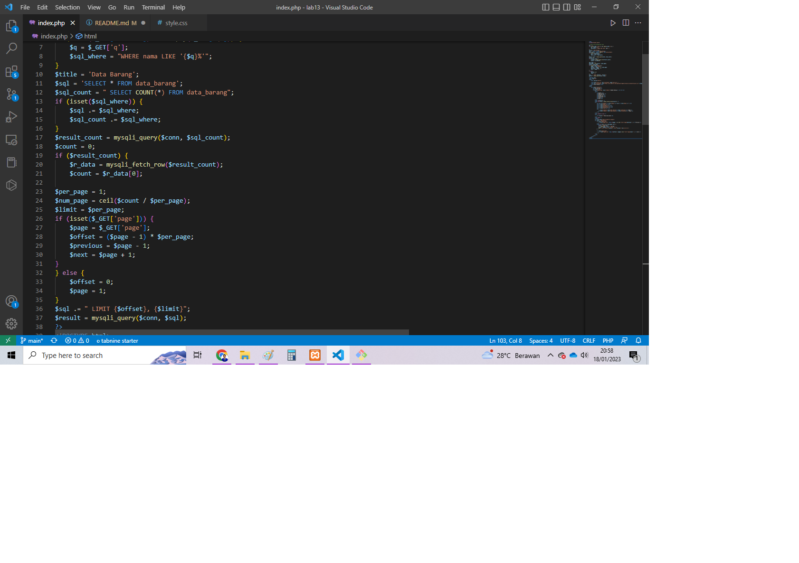
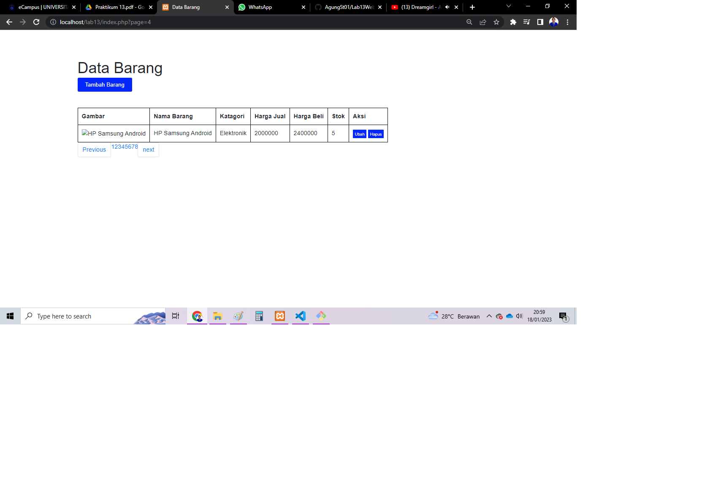

# Lab13Web
### Pagination

Di Repository Lab13Web ini kita akan belajar membuat pagination.

Pagination digunakan untuk membatasi atau membagi record data yang akan ditampilkan pada
laman web. Dari seluruh record data yang ada akan dibagi berdasarkan jumlah record
per-halaman.

Pada prinsipnya untuk membatasi tampilan record data pada query mysql menggunakan LIMIT
dan OFFSET;

### Membuat Pagination
Lakukanlah pengeditan kode pada index.php, dan masukan kode berikut :

Maka hasilnya akan menjadi seperti berikut :

